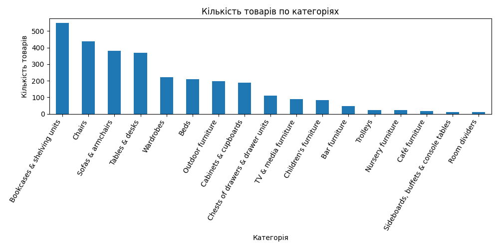
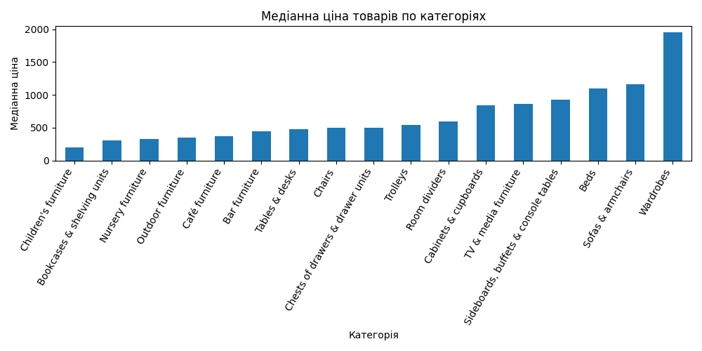
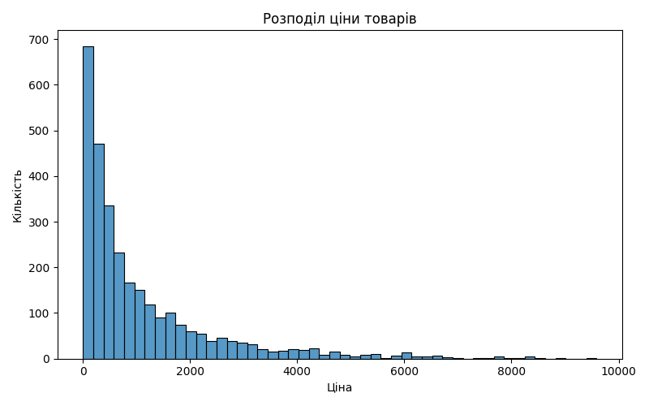
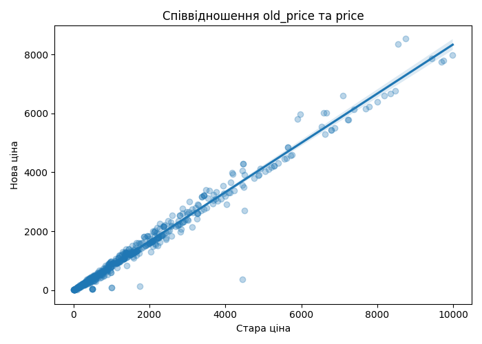
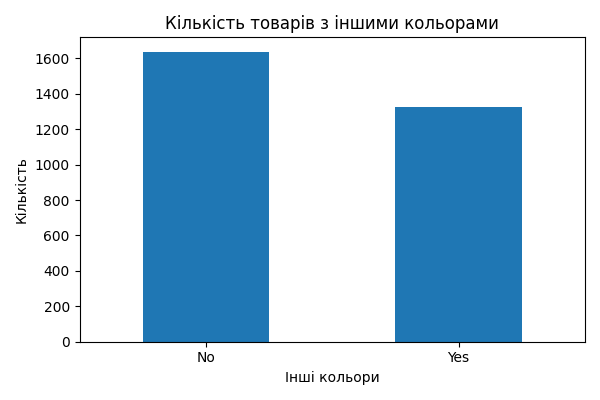
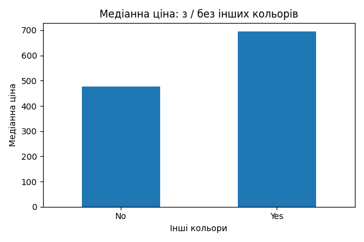
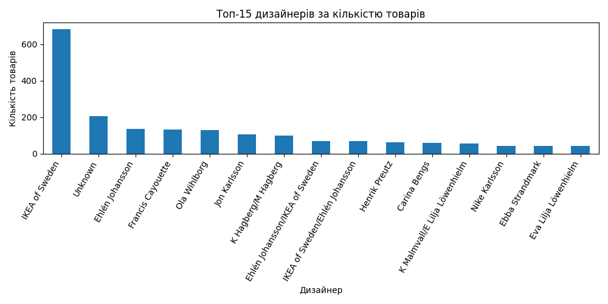
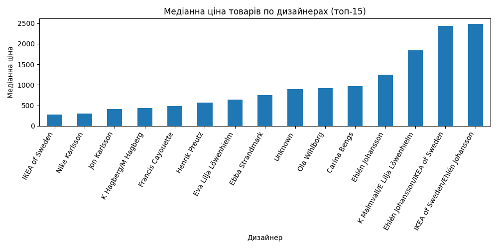
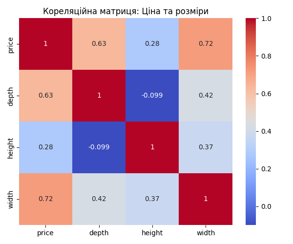
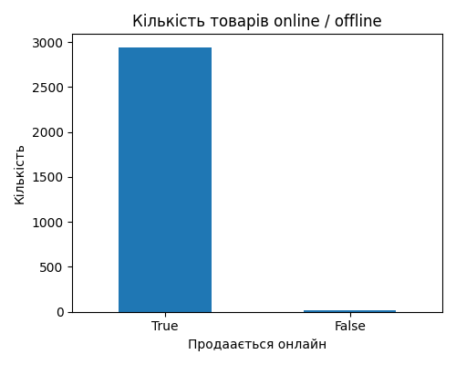

# ikea
This project focuses on analyzing IKEA product data to uncover key patterns and build a machine learning model for price prediction based on product characteristics.  The goal was to explore the dataset, identify the main factors influencing product prices, and develop a predictive model that can estimate prices using available features.

# Key Steps:
- Data loading and cleaning
- Exploratory Data Analysis (EDA)
- Hypothesis testing
- Machine learning model development for price prediction

# EDA:

