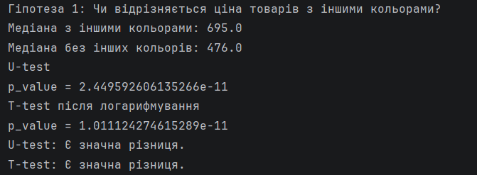
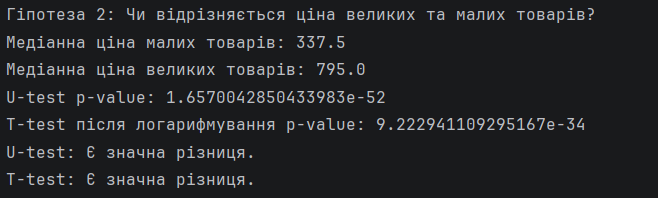
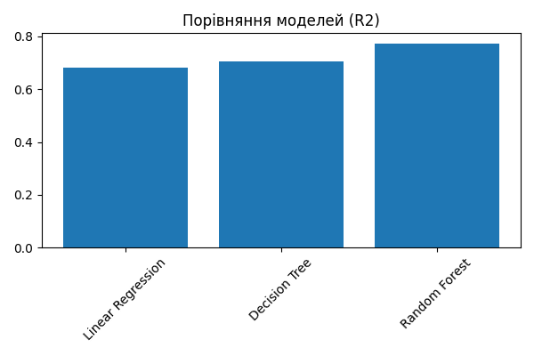
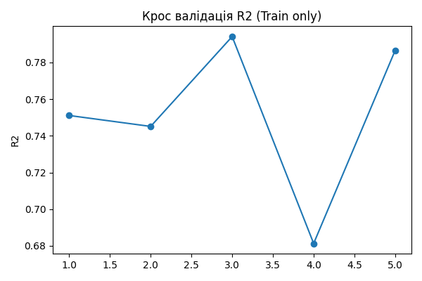
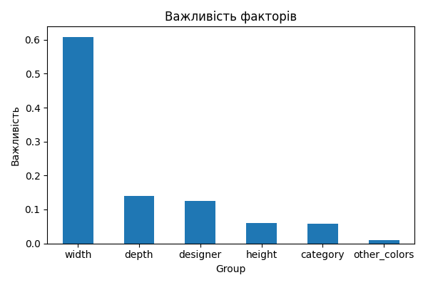
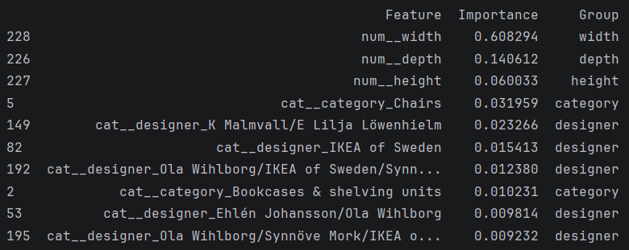

# ikea
This project focuses on analyzing IKEA product data to uncover key patterns and build a machine learning model for price prediction based on product characteristics.  The goal was to explore the dataset, identify the main factors influencing product prices, and develop a predictive model that can estimate prices using available features.

# Dataset:
Dataset includes:
- item name
- category
- price (old and current)
- if it`s sellable online
- link
- short descripttion
- designer
- sizes (width, height, depth)
*[(Dataset)](https://raw.githubusercontent.com/rfordatascience/tidytuesday/master/data/2020/2020-11-03/ikea.csv)*

# Key Steps:
- Data preparation (loading, cleaning)
- Exploratory Data Analysis (EDA)
- Hypothesis testing
- Machine learning model development for price prediction

# Data preparation:
The dataset was collected from an online source and loaded into a pandas DataFrame. Several preprocessing steps were performed to ensure data quality and consistency.
- Removed duplicates and unnecessary columns
- Handled missing values and standardized categorical data (e.g., designer, category)
- Cleaned text fields and removed irrelevant characters
- Converted numerical features (price, dimensions) to appropriate formats
- Replaced invalid values (e.g., zeros in dimensions) with nulls

# EDA:
Key insights:
- Some designers tend to create higher-priced products
- Product price strongly depends on its category
- The highest prices are observed in large-sized furniture
- Most products are relatively low-priced
- Pricing is consistent, as there is a clear relationship between old and new prices
- Most products are available in a single color
- Products available in multiple colors tend to have a higher median price
- The majority of products are created by a single designer
- Product price is most strongly influenced by its width
- The vast majority of products are available online
  

# Hypothesis testing:
- Products available in multiple colors have a statistically significantly higher price compared to single-color products (p < 0.001). The difference in median prices suggests a moderate effect.
- Large products have significantly higher prices than small ones (p < 0.001), with a substantial difference in median values, indicating a strong effect of product size on pricing.
- Results are consistent across both non-parametric (Mann–Whitney U test) and parametric tests after log transformation, confirming robustness.
  

# Machine learning:
The objective of this stage was to build a model to predict product prices based on their characteristics.

The target variable was price. Several columns were excluded from the modeling process to ensure data quality and prevent data leakage, including identifiers, technical fields, and non-informative text features (e.g., item ID, links, descriptions, and old price).

A machine learning pipeline was implemented to streamline preprocessing and modeling. It included:
- OneHotEncoder for transforming categorical variables into numerical format
- StandardScaler for normalizing numerical features
- A machine learning model
- K-fold cross-validation for robust performance evaluation

To improve model performance, the following techniques were applied:
- Hyperparameter tuning using GridSearchCV
- Use of an ensemble model (Random Forest)
- Data normalization
- Cross-validation to ensure stable and generalizable results

Model Comparison:
Linear Regression: R² = 0.68
Decision Tree: R² = 0.71
Random Forest: R² = 0.77

The Random Forest model showed the best performance:
R² = 0.77
RMSE = 653
Cross-validation mean R² = 0.75

Key Drivers of Price:
Product dimensions (width, depth, height)
Product category
Designer

Among all features, width was identified as the most influential factor affecting price.

#  Author
Nataliia Patsai  
